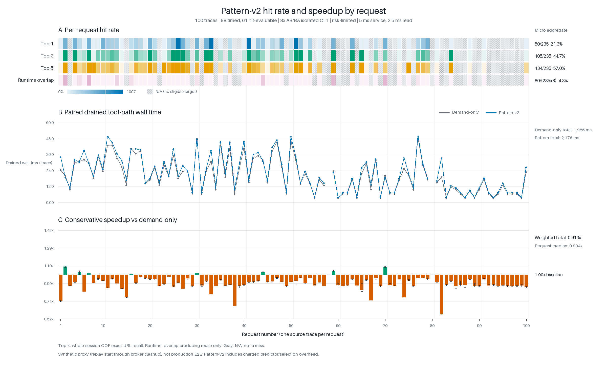

# Pattern-v2 策略、共享资源调度与逐 Request 实验

## 摘要

Pattern-v2 是一套非神经的 Pattern Mining / Pattern Matching 方法。它不使用
Transformer embedding、反向传播模型或在线 LLM 推理，而是把当前搜索结果、
最近搜索历史和已访问 URL 组织成离散 pattern，再用计数表估计下一个工具是否为
`visit` 以及某个候选是否为精确 URL。真正执行 speculation 前，还要经过置信度、
预期收益、全局预算和共享资源 broker 四层约束。

在多个 agent request 同时存在时，当前策略不是“每个 request 都发 Top-k”，而是让
所有 request 的候选竞争一个很小的全局 speculative budget。Authoritative call
完成 broker 入队后，在所有当前可调度的 queued work 中优先；speculation 只能使用
受限的 worker 和 tool capacity。这里的 priority 不覆盖入队前的 sweep/cleanup，且只
影响尚未开始的任务，不能硬抢占已经运行的调用。

本次逐 Request 实验在 100 条 Qwen trace 上得到：Exact Recall@1/3/5 为
21.3% / 44.7% / 57.0%，实际产生复用或 in-flight promotion 的 runtime hit rate
为 4.3%。在 5 ms synthetic service、2.5 ms lead、单 trace 隔离重放的条件下，
98 条有 modeled tool path 的 trace 上，Pattern-v2 drained wall 汇总为
2,176.4 ms，demand-only 为 1,986.0 ms，因而 speedup factor 是 0.913x，即
整体慢 9.59%。



## 1. 系统边界与术语

本文区分两类 tool call：

- **Speculative call**：agent 尚未确认下一步工具前，根据 Pattern-v2 提前启动的
  `visit(url)`。
- **Authoritative call**：agent 完成正常决策后，真正要求执行并允许提交结果的
  tool call。

Broker 只调度 tool execution，不调度 agent 的 LLM generation。本实验也没有启动
vLLM、神经模型或网络服务；所谓“normal agent call”在本文中专指 agent 已确认的
authoritative tool call。

完整路径如下：

```text
search result
  -> session-local current/history/visited state
  -> rank + recency + visited Pattern-v2 ranking
  -> frozen Top-5 and abstain gate
  -> empirical-count P(next_tool=visit) and P(exact URL | visit)
  -> global confidence/utility selector across active requests
  -> speculative queue in shared broker

agent confirms its actual tool call
  -> authoritative queue in the same broker
  -> exact same-session match: promote / join inflight / reuse
  -> no exact match: execute a fresh authoritative call
  -> only the authoritative path may commit a result
```

## 2. Pattern-v2 如何生成候选

### 2.1 离散 Rank Pattern

离线阶段只统计历史开发 trace 中，真实 authoritative visit URL 在 search response
里出现时对应的 displayed-rank hit count。它得到的是 `rank_counts[rank]` 计数表，
不是训练一个分类神经网络。

每个 agent session 在运行时独立维护：

- 当前 search response：本次 decision 内不截断。
- 历史 URL LRU：最多 64 个 URL。
- Visited URL LRU：独立的 64 个 URL，仅在 authoritative visit commit 后更新。
- 历史候选只保留最近两次 search，即 `search_age <= 2`。
- URL 使用原始、精确的 HTTP(S) 字符串；不做语义匹配、decode、case-fold 或 URL
  normalization。

每个 URL 的冻结基础分数是：

```text
score = log(rank_count + 0.5)
        - 1.5 * search_age
        - 1.0 * was_visited
```

这体现三个直觉：历史上常命中的 rank 更可信，旧搜索结果逐步降权，已经访问过的
URL 降权但不被彻底禁止。当前 response 内相同 URL 会先去重，当前与历史重复的 URL
也只保留一份。

只要当前 response 非空，Top-1 会保持 legacy M0 的 current-response anchor：先按
`rank_count`，再按原始 ordinal 和 exact URL。这样历史 cache 不会意外改变旧方法的
Top-1。其余位置按综合分数和确定性 tie-break 排序，最终保留 Top-5。

### 2.2 固定 abstain gate

基础 gate 在以下情况不预测：

```text
没有可用候选
OR
(query_count >= 10 AND consecutive_search_streak == 2)
```

其余 pattern 默认 admit。连续 search streak 会在 search 后增加，在 committed visit
或其他 tool 后清零。Gate 拒绝时，runtime predictions 为空，但离线分析仍保留
`ranked_top_k`；概率层也会把同一 hard-abstain pattern 的 exact probability 设为 0。

### 2.3 非神经的概率校准

为了避免把 Top-5 全部发出去，Pattern-v2 上面增加了一层 hierarchical
empirical-Bayes count table：

```text
P(candidate is exact)
  = P(next_tool = visit)
  * P(candidate is exact | next_tool = visit)
```

第一张表使用以下离散 key：

- query-count bucket：`1`、`2`、`3-4`、`5-9`、`10+`；
- consecutive-search-streak bucket：`1`、`2`、`3+`；
- search-sequence bucket：`1`、`2`、`3-4`、`5+`。

第二张表使用：

- Pattern-v2 Top-k position；
- 当前 response 中是否重复出现；
- source-rank bucket；
- 候选来自 current response 还是 history；
- 是否已经 visited。

稀疏 pattern 会按 detail -> position/query bucket -> global prior 确定性回退，并用
固定强度做 shrinkage。`candidate_count`、`current_count`、`search_age`、
`appearances` 等信息会保留在 candidate/telemetry 中，但当前概率表并未把它们全部
放进 key。

实验中的概率全部来自 outer-5 / inner-4 whole-session grouped OOF。完整 session
始终属于同一 fold，避免同一 session 的后续行为泄漏到自己的预测中。

## 3. 多 Request 下如何分配 speculative 机会

### 3.1 Session stream batching

当 offered concurrency 为 `C` 时，系统最多同时维护 `C` 个 source-session stream。
每个 batch 只取每个 active session 的当前 head decision，因此：

- 同一个 session 内的 decisions 始终保持因果顺序；
- 不会把同一 trace 内多个 decision 并行化；
- 一个 session 完成后，等待队列中的下一个 session 再补入；
- 同一时刻不同 session 的 candidates 才会进入全局竞争。

### 3.2 Risk-limited 选择流程

本文结果使用 `utility_global_risk_limited`：

1. 用 fold-train 中每个 window 的平均 executable calls 估计 coarse authority
   pressure。
2. 如果 normalized coarse pressure `> 2.0`，即该 batch 的预计 calls 大于
   `2 * visit_capacity`，整批 abstain，并在部署模型和 runtime charge 口径中跳过
   后续候选/概率评估路径。
3. 否则计算每个候选的 exact probability，先过滤 `p_exact < 0.20` 的候选。
4. 根据 forecast authority pressure 选择 shadow price。
5. 计算每个候选的 expected net utility 和 utility density。
6. 把所有 active requests 的候选放进同一全局池，只选正 utility 且处于全局预算内
   的候选。

Shadow price 的冻结分段如下：

| Forecast pressure | Shadow price |
|---:|---:|
| `<= 0.5` | 0.02 |
| `<= 1.0` | 0.05 |
| `<= 2.0` | 0.10 |
| `> 2.0` | 0.20 |

Coarse pressure 和这里的 fine forecast pressure 是两个估计量。即使 coarse gate
没有触发，fine pressure 仍可能大于 2.0；此时 selector 使用 0.20 的 shadow price，
再由 utility 决定是否选择，而不是无条件 abstain。另需注意，本实验的
`ScoredWindow` 在 OOF 阶段已经离线预计算；“跳过后续评估”描述的是预期在线 fast
path 及其 runtime 计费，而不是声称本次离线预计算从未发生。

令 `p` 为 exact probability，`S` 为预计 tool service time，`L` 为 prediction lead，
默认 task weight 为 1：

```text
overlap = min(S, L)

net_utility = p * overlap
              - (1 - p) * shadow_price * S

utility_density = net_utility / S
```

候选按 utility density、net utility 降序排列，最后用
`SHA256(session_id, decision_id, URL)` 稳定打破平局。当前没有 per-request quota 或
round-robin 公平保证；这是刻意的全局收益最大化，因此一个 request 可能拿到多个名额，
也可能完全拿不到。

全局 start budget 为：

```text
speculative_slots = min(max_speculative_workers,
                        visit_capacity - authoritative_reserve)

starts_per_slot = max(1, ceil(lead / service))

start_budget = speculative_slots * starts_per_slot
```

本实验配置为 visit capacity 2、authority reserve 1、最多 1 个 speculative worker、
lead 2.5 ms、service 5 ms，所以每个 batch 最多选择 **1 个 speculative start**。
即使 `C` 增大，预算也不会按 request 数量扩张，只会有更多 requests 竞争这一个名额。

选择器本身支持把实时 authoritative running/queued 数量放进 pressure，并在 backlog
时 kill speculation；但当前 adaptive/per-trace runner 的选择调用只传入了 OOF
forecast，没有把 broker 实时队列计数反馈给 selector。因此本实验中真正生效的是
forecast pressure、coarse gate，以及 broker 层的实际 authority-first 调度，不能把
它描述成完整的实时 backlog feedback controller。

### 3.3 原子 admission 与 deadline

选中的 candidates 会作为一个 microbatch 原子提交：完整 batch 先全部进入 broker
视野，然后再调度。这样 pending capacity 紧张时，高 utility request 会先获得 admission，
不会因为调用顺序而让较低 utility candidate 抢先启动。

每个 batch 共享一个 absolute `start_deadline = decision_start + lead`：

- selection/admission 已经耗尽 lead 时，不再提交 speculation；
- 到 deadline 仍 queued 的 speculation 在启动前失效，没有 physical service cost；
- deadline 前已经开始的 call 不会被 deadline 强杀，仍可被后续 authoritative call
  claim，并受 TTL/cleanup 管理。

## 4. Authoritative 与 speculative 的优先级和资源控制

### 4.1 两条队列

Authoritative 和 speculative 共用同一个 `LiveToolBroker`、worker pool 和 per-tool
capacity，但使用两条队列：

- Authoritative lane：在当前可调度的 jobs 中保持 FIFO，不接受 speculative score
  重排；若队首因某个 tool 的 capacity 或 rate gate 被阻塞，后面可调度的其他 tool
  authority 可以先运行。
- Speculative lane：按 caller 传入的 utility density 从高到低调度，同分按入队顺序。

本策略设置 `min_speculative_workers = 0`。一项 authority 完成入队后，每次有 broker
slot 可用时，调度顺序是：

1. 先找可运行的 authoritative job；
2. 只有没有可运行 authority 时，才找 speculative job；
3. 同时还必须满足 global worker、speculative worker、tool capacity 和 rate gate。

`authoritative()` API 在真正入队前会先执行一次 sweep；如果 sweep 正在等待一个已经
过期但不可抢占的 speculation 清理，新 authority 可能在入队前被拖住。因此这里的
authority-first 不是从“agent 确认时刻”开始的硬延迟保证，而是 admission 完成后、
当前可调度 queued work 之间的 dispatch 规则。

Broker 也支持可选的 `min_speculative_workers=1` 模式：允许一个 speculative start
越过已排队的同 tool authority，随后用 debt 机制要求下一个竞争 start 偿还给
authority。但本次 Pattern-v2 策略没有启用它，所以当前结果是 admission 后对
dispatchable queued work 的 authority-first。

### 4.2 四层容量边界

| 控制层 | 当前实验值 | 作用 |
|---|---:|---|
| Global workers | 4 | Broker 同时跟踪的 authoritative 与 speculative executor coroutine 总上限 |
| Global speculative workers | 1 | Broker 同时跟踪的 speculative executor coroutine 最多 1 个 |
| `visit` capacity | 2 | 两条 lane 合计最多同时跟踪 2 个 visit executor coroutine |
| `visit` authoritative reserve | 1 | speculative visit 最多占 `2-1=1` 个 visit slot |
| Speculative pending cap | 64 | queued、running、completed-unclaimed prediction 合计上限 |
| TTL | 1 s | 清理长期未 claim 的 prediction |

`authoritative reserve` 是对 broker-tracked speculative 并发的上限，不是独立 worker
pool，也不是对已运行任务的抢占。Authority 可以使用所有空闲 visit slots；speculation
永远不能在 broker 计数中占满两个 visit slots。Pending cap 只会拒绝新的 speculation，
绝不会拒绝 authoritative call。

这些 counter 在 executor coroutine 退出时释放。若 executor 像本实验的 synthetic
executor 一样，保证物理工作 drain 后才退出，那么上述数值也就是物理调用上限；若
底层 blocking thread、I/O 或 detached task 在 coroutine 取消后仍继续运行，物理工作
可能在 broker 已释放 slot 后继续。因此不能把这些通用 counter 无条件理解为底层物理
资源的硬上限。

Broker 还支持共享的 per-tool minimum start interval，但本实验未配置这个 rate gate。
如果启用，speculative start 也会消耗共享 token；reserve 并不额外保留 start-rate
token。

### 4.3 Authoritative 到达后的 exact-match 状态机

Prediction identity 为：

```text
(session_id, tool_name, canonical full JSON arguments)
```

因此只允许同一 session、同一工具、完整参数精确相同的 authority claim prediction，
不会跨 session 复用，也不会只凭相似 URL 命中。

| Prediction 状态 | Broker 动作 | Source | 是否计 runtime overlap hit |
|---|---|---|---|
| 不存在 | 新建 authoritative FIFO job | `executed` | 否 |
| Queued | 提升到 authoritative lane，旧 speculative heap entry 失效 | `promoted_from_queue` | 否 |
| Running | 继续等待同一个物理调用 | `promoted_inflight` | 是 |
| Completed | 直接复用已经完成的结果 | `reused` | 是 |
| Failed | 不提交失败结果，fresh authoritative fallback | `executed_after_speculative_failure` | 否 |

Queued promotion 不算 overlap，是因为 speculative work 尚未实际提前执行。只有
completed reuse 和 in-flight promotion 说明 authority 确实复用了提前完成的 service，
所以本文的 Overall runtime hit 只统计这两种来源。

Speculative result 在 exact authoritative claim 前始终是 private 的；只有 authoritative
路径能够越过唯一 commit boundary。Prediction 被 claim 后是 single-use，并发到达的
第二个相同 authoritative call 会正常 fresh execute。

### 4.4 “抢占”的准确边界

当前实现有两类逻辑抢占：

- 尚未开始的 authoritative job 在 dispatch 时优先于 speculative job；
- exact queued prediction 可以提升到 authoritative lane。

但它**没有保证性的物理硬抢占**。如果一个错误 speculative call 已经运行：

- 新 authority 不能把它从 worker/tool slot 上立即驱逐；
- cancellation 只向 asyncio runner 发送 cooperative cancel；
- blocking thread、shielded HTTP 或其他不可抢占 executor 仍可能运行到物理结束；
- broker worker/tool counter 在 executor coroutine 退出时释放；只有 executor contract
  保证退出前等待物理工作 drain 时，这才等同于物理 capacity 的释放。本实验的
  synthetic executor 正是这种 drain-aware 行为。

Bulk cancellation 会先在 broker lock 内一次性让所有待取消的 queued siblings 失效，
再取消并等待 running jobs。这样可以避免“取消第一个任务释放 slot，反而让另一个本来
也要取消的 queued speculation 启动”，但无法缩短不可抢占 call 已经消耗的 service。

因此 authority-first 的准确保证是：

> 对尚未开始的工作提供 dispatch 优先级，并用 global/per-tool speculative caps 为
> authoritative traffic 保留并发余量；它不保证抢占已运行的错误 speculation，也不
> 保证零干扰。

严格零干扰需要 dedicated capacity、真正可抢占的 executor，或者在不确定时完全
abstain。

## 5. 一次 decision 的端到端调度过程

以一批并发 requests 为例：

1. 每个 active session 提交一个当前 search decision。
2. Pattern-v2 从 current/history/visited state 生成 gated Top-5。
3. Count calibrator 给出 `P(next_tool=visit)` 和每个 exact URL 的概率。
4. Risk policy 根据 forecast pressure、0.20 概率门槛和 utility 计算全局排序。
5. 在本配置中，全 batch 最多选一个 candidate，带 start deadline 原子提交给 broker。
6. Broker 仅在没有 dispatchable authority 且有 speculative capacity 时启动它。
7. Lead 结束后，正常 agent 决策产生 authoritative invocation。
8. Exact match 时按 queued/running/completed 状态 promote 或 reuse；没有 match 时走
   authoritative FIFO fresh execution。
9. 已知该 session 的真实目标后，未命中的 prediction 被原子 detach/cancel；已运行、
   不可抢占的错误调用仍需 drain，并计入 wasted speculative service。
10. Broker cleanup 完成后才结束本次 drained-wall 计时。

## 6. 本次逐 Request 实验 setup

### 6.1 数据与预测协议

- 数据：`traces/my_traces` 中 100 个 JSONL source traces。
- Request 轴：从文件名 `_task<N>_` 解析为 Request 1 到 100，不使用 lexical 排序。
- Search decisions：340。
- 可执行 exact HTTP(S) authoritative targets：235。
- Request 27 中另有一个 `view-source:` label，因不能执行而不进入 runtime 分母。
- 预测：outer-5 / inner-4 whole-session grouped OOF。
- 证据属性：development OOF，不是 untouched confirmatory holdout。

Trace 分类如下：

| Trace 类型 | 数量 | Top-k / runtime hit | Drained-wall timing |
|---|---:|---|---|
| 有 search 且有 executable visit target | 61 | 有效 | 有效 |
| 有 search、无 executable visit target | 37 | N/A；没有分母 | 有效；预测开销和必错 speculation 均计入 |
| 无 search decision：Request 58、80 | 2 | N/A | N/A；没有可建模 tool path |
| 合计 | 100 | 61 可评估，39 N/A | 98 有 timing，2 N/A |

39 个 hit N/A 不是 39 个 miss。尤其是其中 37 个 trace 虽没有 target，仍可能错误
speculate，因此必须进入总体 latency 和 waste 统计。

### 6.2 Timing protocol

- 每条有 search 的 trace 单独重放，`offered_concurrency=1`。
- 每条 trace 重复 8 次，demand-only / Pattern-v2 使用 AB/BA counterbalanced 顺序。
- 4 shared workers，`visit capacity=2`。
- `max_speculative_workers=1`，`visit authoritative reserve=1`。
- `max_speculative_pending=64`。
- Synthetic visit service：5 ms。
- Prediction lead：2.5 ms。
- Executor 被设计成不可硬抢占：收到 cancel 后仍等待物理 sleep 完成，以暴露真实的
  wrong-speculation cleanup tail。
- 两组使用相同 search-decision 与 authoritative-target 时间线；baseline 不发
  speculation。
- 无网络、无 vLLM、无在线模型服务。

Pattern feature 的实测 mean/p99 为 0.382/0.764 ms per decision；概率查表的
mean/p99 为 0.0028/0.0035 ms per candidate。主 latency 指标是从 replay start 到最终
broker cleanup 的 drained wall。Pattern-v2 的 feature/probability lookup 开销被保守
串行加入；selection/admission 已经在实测 wall 中，不重复计费。

8 次重复用于减小 asyncio 调度顺序噪声，不是 8 份独立 accuracy 样本。Top-k 预测值
由 grouped OOF 一次确定。

### 6.3 指标定义

- **Exact Recall@k**：冻结 gate 后 Top-k 中命中的 executable authoritative targets
  数量 / 235。它是候选可用性，不代表实际发射。
- **Overall runtime hit**：`reused + promoted_inflight` / authoritative target
  observations；`promoted_from_queue` 不计。
- **Speedup factor**：98 条 timed trace 上的
  `sum(demand-only drained wall) / sum(Pattern-v2 drained wall)`。大于 1 才是
  加速，小于 1 是变慢。
- **Wasted work**：已经开始但最终没有 authoritative commit 的 speculative service。

## 7. 结果

| 指标 | 结果 |
|---|---:|
| Exact Recall@1 | 50/235 = 21.3% |
| Exact Recall@3 | 105/235 = 44.7% |
| Exact Recall@5 | 134/235 = 57.0% |
| Overall runtime hit | 80/(235 x 8) = 4.3% |
| Demand-only drained wall | 1,986.0 ms |
| Pattern-v2 drained wall | 2,176.4 ms |
| Weighted speedup factor | 0.913x |
| Request-level median factor | 0.904x |
| 有正收益的 requests | 8/98 |

`0.913x` 不能解释为“加速 8.7%”。因为 Pattern-v2 用时更长，正确解释是：

```text
2176.4 / 1986.0 - 1 = 9.59% slower
```

100-trace corpus 中 98 条有 tool path 的 trace 每次 replay 的平均资源代价为：

| Runtime work | 每 replay |
|---|---:|
| Selected speculative candidates | 45 |
| Exact selected candidates | 10 |
| Overlap-producing hits | 10；本次恰好与 exact selected 同值 |
| Wrong speculative starts | 35 |
| Extra physical calls | 35 |
| Physical call amplification | (235 + 35) / 235 = 1.149x |
| Wasted speculative service | 188.2 ms |

只有 Request 2、5、7、16、30、44、59、70 的平均 drained wall 优于
demand-only。

结果说明 Top-k ranking quality 和 runtime benefit 之间存在明显距离。Top-5 中存在
正确 URL 不代表它一定通过 0.20 floor、utility、global budget、broker admission 和
deadline；即使发射正确，也只有在 authority 到来前已经开始或完成才产生 overlap。
反过来，错误调用会增加 physical calls 和 cleanup tail。在当前很短的 5 ms service
设定下，这些成本超过了每次 replay 10 个正确 overlap 带来的收益。

## 8. 多请求结论与实验限制

调度设计本身支持 `C>1`，并通过“全局一个小预算 + forecast abstention + broker
authority-first + per-tool reserve”避免 speculative 数量随请求数线性增长。高负载时，
预期行为是逐步 abstain 并退化到 demand-only，而不是强制每个 request 都 speculative。

但本报告的逐 Request 图为了让 x 轴上的每条 trace 可独立比较，timing 使用的是
isolated `C=1`。因此 0.913x 是逐 trace workload 的 drained-wall 汇总，不是并发生产
环境的端到端加速。多请求 burst 与 sustained/open-loop 结果分别记录在：

- [Adaptive load report](../pattern_v2_adaptive_load/REPORT.md)
- [Open-loop stress report](../pattern_v2_open_loop_stress/REPORT.md)

这些结果的共同边界是：reserve 可以限制 simultaneous interference，不能抢占已经运行
的不可抢占 call；mostly-wrong 情况下只能保证正确性和占用上界，不能保证零 latency
regression。真实网络工具通常比 5 ms 更慢，可能增加正确 speculation 的收益，同时也会
放大错误调用的成本，必须用真实 service distribution 和 arrival process 重新验证。

## 9. 实现、数据和复现

主要实现：

- [Pattern-v2 predictor](../../paste_repro/pattern_predictor.py)
- [Count calibrator and utility policy](../../paste_repro/speculation_policy.py)
- [Shared authoritative/speculative broker](../../paste_repro/live_broker.py)
- [Adaptive multi-request replay](../../scripts/run_pattern_v2_adaptive_load.py)
- [Per-trace experiment runner](../../scripts/run_pattern_v2_per_trace.py)

本次结果：

- [完整 metrics.json](./metrics.json)
- [逐 Request CSV](./per_request.csv)
- [PNG 图](./pattern_v2_per_request.png)
- [SVG 图](./pattern_v2_per_request.svg)

复现实验：

```bash
cd /home/aiscuser/PASTE-Qwen-DR
python reproduction/scripts/run_pattern_v2_per_trace.py \
  --output-dir reproduction/results/pattern_v2_per_trace

python reproduction/scripts/render_pattern_v2_per_trace.py \
  --input reproduction/results/pattern_v2_per_trace/metrics.json \
  --output-prefix reproduction/results/pattern_v2_per_trace/pattern_v2_per_request \
  --request-count 100 \
  --title 'Pattern-v2 hit rate and speedup by request' \
  --subtitle '100 traces | 98 timed, 61 hit-evaluable | 8x AB/BA isolated C=1 | risk-limited | 5 ms service, 2.5 ms lead'
```
