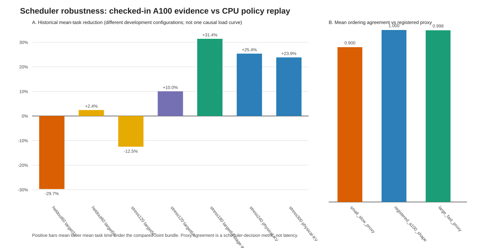

# Co-Scheduler Specification and Robustness Audit

Date: 2026-08-30

## Bottom line

The Qwen reproduction now has an executable, exact decomposition of its
deployed Joint-v2 score and a deterministic 108-state sensitivity replay.  It
also has meaningful checked-in A100 load evidence.  These artifacts **do not
yet close the reviewer's cross-model/cross-GPU generalization concern**:
all GPU points re-extracted by this script use the same Qwen/A100 family, and
this command itself never launches a model server.  The CPU sweep tests
scheduler decisions under throughput/KV proxies, not model latency.

There is also a specification mismatch that should be fixed in the paper.  The
paper's abstract `ExposedToolGain / LLMPressure + Aging` and
`DecodeLoad + gamma * KVLoad` equations are not literal expressions in the
Qwen hook.  The registered formal path uses an additive cost plus independent
physical-KV admission.  It would be inaccurate to claim that the code directly
implements the paper variables under those names.

## Exact deployed policy

Candidates are lower-is-better.  With prefix locality disabled in the formal
configuration, the continuous score is:

```text
C_i = P_llm,i - G_tool,i - G_progress,i - A_i

service_i = pt_i / prefill_rate + po_i / decode_rate
G_tool,i = beta * confidence_i * min(next_tool_wait_i, 80 s)
           / (1 + projected_KV_pressure_i * pt_i / context_ref)
A_i = aging_alpha * scheduler_wait_i
```

`P_llm` is the sum of service time, a nonlinear context/KV contention term,
task-tail cost, any over-budget penalty, and a cold-session penalty.
`G_progress` contains final-call and reciprocal-progress bonuses.  In the
registered configuration, a final-call lane and an exact remaining-call lane
are lexicographic keys *before* the continuous score.  Thus this is not a
literal gain/pressure ratio.

The audit reimplements those terms only for observability, then compares the
sum against production `_joint_v2_score_s`.  Maximum absolute disagreement
across all replayed candidate states is `1.421e-14` seconds.

### Reviewer term to implementation mapping

| Reviewer term | What this Qwen implementation actually uses | Active in formal physical-KV path? |
|---|---|---|
| ExposedToolGain | execution-aware `nwc * min(nw, 80)` bonus, damped by prompt length and projected logical KV pressure | yes, as a surrogate |
| LLMPressure | additive service/context/task-tail/over-budget/cold-session cost in seconds | yes, as a surrogate |
| DecodeLoad | engine running-request count relative to configured target/max | **no**; physical-KV admission bypasses the decode-band helper |
| KVLoad | logical projected tokens for ranking; physical block usage and forecast footprint for admission | yes |
| pressure band | legacy `.82–1.02` HBM controller | **no**; formal uses physical target utilization `.93` |
| gamma | no literal Joint-v2 gamma; nearest non-equivalent knob is context alpha `1.4` with pressure exponent `1.35` | no literal gamma |
| aging | `0.2 * wait_seconds`, plus a 40-second physical rescue deadline | yes |
| speculation budget | 4 global workers, max 2 speculative, visit cap 2, pending cap 128, TTL 120 s, min reservation 0 | tool-side broker |

The live agent records `nrg/nps` and global queue counts for evidence, but the
Joint-v2 score directly reads `nw/nwc/rtw`; it does not directly read the
completed-ready flag or global broker queue counts.  In particular, a completed
prediction has estimated remaining wait zero, so this checkout should not
claim a fully realized-gain feedback term without adding and validating that
side channel.

## Parameter selection evidence

- Prefill/decode rates (`38112` and `113.7` token/s) are calibration constants,
  not universal model/GPU constants.
- The active physical-KV target is `0.93`; predicted footprints are rounded to
  native block size and one request older than 40 seconds may consume the 7%
  reserve, but never cross 100% physical capacity.
- The formal aging coefficient is `0.2`, so 40 seconds of scheduler wait lowers
  continuous cost by 8 seconds.  The 40-second rescue is the hard progress
  mechanism under physical admission.
- The legacy low/high pressure-band sweep produced the same physical admit
  count(s) `[18]`, confirming that those variables are inactive
  in this path.  In contrast, the active utilization sweep changed admit counts
  as follows: `0.85→14, 0.90→18, 0.93→18, 0.97→18`.
- The tool budget was bounded structurally at two speculative workers because
  there are four global workers and visit capacity is two.  Development F1
  (`min_speculative_workers=1`) improved only `0.2079%` over F0, only `6/16`
  sources were faster, and the bootstrap interval crossed zero; therefore F0
  (`min=0`) was frozen.  `max=2` and pending cap `128` were not independently
  hardware-swept and should not be described as universally optimal.

The single-factor replay below holds the registered A100-shape proxy, mixed
workload, `1x` context, and `0.70` load fixed.  “Full” includes lexicographic
stage lanes; “continuous” isolates the additive score.  This distinction is
why some large coefficient changes alter the continuous ranking while the
full-policy ranking remains unchanged.

| Parameter | Value | Full pairwise agreement | Continuous agreement | Physical admits |
|---|---:|---:|---:|---:|
| context_alpha_gamma_analogue | `0` | 1.000 | 1.000 | 18 |
| context_alpha_gamma_analogue | `0.7` | 1.000 | 1.000 | 18 |
| context_alpha_gamma_analogue | `1.4` | 1.000 | 1.000 | 18 |
| context_alpha_gamma_analogue | `2.8` | 1.000 | 0.941 | 18 |
| aging_alpha | `0` | 0.941 | 0.941 | 18 |
| aging_alpha | `0.1` | 0.941 | 0.941 | 18 |
| aging_alpha | `0.2` | 1.000 | 1.000 | 18 |
| aging_alpha | `0.4` | 1.000 | 0.941 | 18 |
| tool_gain_beta | `0` | 0.941 | 0.941 | 18 |
| tool_gain_beta | `0.45` | 1.000 | 1.000 | 18 |
| tool_gain_beta | `0.9` | 1.000 | 1.000 | 18 |
| tool_gain_beta | `1.8` | 1.000 | 0.647 | 18 |
| physical_kv_target_utilization | `0.85` | 1.000 | 1.000 | 14 |
| physical_kv_target_utilization | `0.90` | 1.000 | 1.000 | 18 |
| physical_kv_target_utilization | `0.93` | 1.000 | 1.000 | 18 |
| physical_kv_target_utilization | `0.97` | 1.000 | 1.000 | 18 |
| legacy_pressure_band | `0.60,0.80` | 1.000 | 1.000 | 18 |
| legacy_pressure_band | `0.82,1.02` | 1.000 | 1.000 | 18 |
| legacy_pressure_band | `0.95,1.20` | 1.000 | 1.000 | 18 |

## Checked-in A100 load evidence

These points are re-extracted from checked-in JSON/reports.  They use different
development configurations, so they are evidence of sensitivity, not one
causal load curve.  Positive reduction is faster under the indicated Joint
bundle.

| Point | Offered sessions | Controller/config | Mean-task reduction | Task-P95 reduction | Evidence role |
|---|---:|---|---:|---:|---|
| heldout60 target32 | 60 | legacy_count_target32 | -29.734% | -17.527% | one_pair_load_sensitivity |
| heldout60 target56 | 60 | legacy_count_target56 | +2.422% | +1.006% | one_pair_load_sensitivity |
| stress120 target56 | 120 | legacy_count_target56 | -12.507% | -11.515% | two_replicate_development |
| stress120 target64 | 120 | legacy_count_target64 | +10.040% | +3.606% | three_replicate_load_sensitivity |
| stress180 target64 stage-aware | 180 | legacy_count_target64_stage_lane | +31.419% | +11.497% | three_replicate_development_load_sensitivity |
| stress240 physical-KV | 240 | physical_kv_target_0.93 | +25.385% | +8.469% | single_screen_load_sensitivity |
| stress300 physical-KV | 300 | physical_kv_target_0.93 | +23.852% | +2.185% | single_screen_load_sensitivity |

The current physical-KV controller is directionally consistent at 240 and 300
offered sessions (`25.385%` and `23.852%` mean-task reductions), but each is a
single development screen.  Both improve task P95, while their source reports
also disclose request-P95 regressions versus FCFS.  Earlier count-target
results range from regressions to large gains.  This is exactly why a frozen
configuration and fresh cross-hardware matrix are required.


## Real-trace central functional A/E (separate evidence tier)

This is a single real-trace center run on one Qwen/A100 shape.  It establishes
that FCFS A and physical-Joint E both execute the same 264 online-metadata
requests and gives a directional functional effect.  It is **not** a
replicated paper result, a `.85/.93/.97` target-sensitivity result, or
cross-model/cross-GPU evidence.

| Point | Task mean A→E (s) | Mean reduction | Task P95 A→E (s) | P95 reduction | Queue reduction | Request-mean reduction |
|---|---:|---:|---:|---:|---:|---:|
| center093 | 91.1907→88.1054 | +3.383% | 100.6761→99.2065 | +1.460% | +35.928% | +3.898% |

- `center093`: 264/264 source-call request keys match per cell; Joint has 155 post-baseline physical samples at target `0.93`, 0 malformed and 0 fail-closed.  Maximum usage was only `0.271`, so the target was not binding.


## Supplied strict live aggregates

None were supplied to this invocation.  A completed formal aggregate can be
SHA-bound and re-extracted with repeatable `--live-aggregate PATH` arguments.


## Completed comment-3 live sensitivity reanalysis

Each run is bound through its plan, completion record, every cell manifest,
raw result/timeline, and server log SHA.  Source keys and reported effects are
independently recomputed; task identities and all 160 tool-invocation digests
must match across cells.  Each cell has one unique fresh server instance.
The fixed execution order was `comment3-target-r3`: `a-c10k-l80` → `e-c10k-l80-u085` → `e-c10k-l80-u093` → `e-c10k-l80-u097`; `comment3-high-r1`: `a-c12k-l80` → `e-c12k-l80-u093`.  These are single-run
development effects without repeats or confidence intervals.

| Run | Shape | A | E | A mean (s) | E mean (s) | Mean reduction | A P95 (s) | E P95 (s) | P95 reduction | Faster sources |
|---|---|---|---|---:|---:|---:|---:|---:|---:|---:|
| comment3-target-r3 | c10k-l80 | a-c10k-l80 | e-c10k-l80-u085 | 209.225 | 148.418 | +29.063% | 300.221 | 248.202 | +17.327% | 78/80 |
| comment3-target-r3 | c10k-l80 | a-c10k-l80 | e-c10k-l80-u093 | 209.225 | 180.549 | +13.706% | 300.221 | 256.475 | +14.571% | 69/80 |
| comment3-target-r3 | c10k-l80 | a-c10k-l80 | e-c10k-l80-u097 | 209.225 | 175.970 | +15.894% | 300.221 | 252.363 | +15.941% | 74/80 |
| comment3-high-r1 | c12k-l80 | a-c12k-l80 | e-c12k-l80-u093 | 249.026 | 218.009 | +12.455% | 313.284 | 273.431 | +12.721% | 78/80 |

| Run | Physical target | E mean (s) | E task P95 (s) | Mean change vs `.93` |
|---|---:|---:|---:|---:|
| comment3-target-r3 | 0.85 | 148.418 | 248.202 | -17.796% |
| comment3-target-r3 | 0.93 | 180.549 | 256.475 | +0.000% |
| comment3-target-r3 | 0.97 | 175.970 | 252.363 | -2.536% |

All three completed target cells are directionally faster than their common A cell in this one execution.  This supports functional execution and a positive
direction relative to one common A observation, not an optimum-target claim.
In particular, the lower `.85` descriptive mean cannot establish that `.85`
is optimal: order was fixed rather than randomized, every cell ran once, and
external HTTP service conditions may drift over wall-clock time.  No post-hoc
significance test is reported, and this one Qwen/A100 run supplies no
cross-model or cross-GPU generalization.


### High-shape one-shot replacement and failed-harness boundary

The completed `high` suite is a separate `12k/80` A/E pair.  Its plan binds
the immutable `comment3-shape-r1` plan, failure, rejected cell-5 contract and
stderr, and server lifecycle evidence.  The loader independently confirms
that formal order index 4 failed deterministically before any chat-completion
request, the server stopped cleanly, and no result, timeline, or manifest was
created for that cell.  It also recomputes old→new high-pair configuration
equality after normalizing only the disclosed run/block/order/server identity
fields.

| Replacement | Failed run | Rejected index | Failed-cell requests | Bound failure files | Excluded observed prefix | Reused | Pooled | Prefix performance loaded/reported |
|---|---|---:|---:|---:|---:|---|---|---|
| comment3-high-r1 | comment3-shape-r1 | 4 | 0 | 7 | 4 | false | false | false |

| Replacement | Cell | Normalized config SHA256 | Equal |
|---|---|---|---|
| comment3-high-r1 | a-c12k-l80 | `27e3111798f7e88ef9e8e04b79d5b67226b0a31865888c9fdd13c41b86d3e2c8` | true |
| comment3-high-r1 | e-c12k-l80-u093 | `80532733913571d0b7ff15e5875231a5f23bd67689e87f3344d1303092e25d61` | true |

The four observed prefix cells from the failed six-cell run are excluded: no
performance value from them is loaded, shown, pooled, or used to select the
replacement.  Both mean task latency and task P95 are lower in the observed E cell.  The high pair remains one
descriptive run without repeats or a confidence interval.

High E's maximum current usage was `0.536` versus
target `0.93`, while predicted-token
budgeting truncated the waiting fit in
`272` marker
samples.  This establishes active controller telemetry; it neither shows that
current usage reached the target nor isolates the target as the cause of the
observed end-to-end effect.


| Run | Cell | Search records | Visit records | Physical HTTP attempts | Retries | HTTP 429 | Min visit-start gap (s) | Broker commits | Broker failures |
|---|---|---:|---:|---:|---:|---:|---:|---:|---:|
| comment3-target-r3 | a-c10k-l80 | 80 | 80 | 160 | 0 | 0 | 3.000 | 160 | 0 |
| comment3-target-r3 | e-c10k-l80-u085 | 80 | 80 | 160 | 0 | 0 | 3.000 | 160 | 0 |
| comment3-target-r3 | e-c10k-l80-u093 | 80 | 80 | 160 | 0 | 0 | 3.000 | 160 | 0 |
| comment3-target-r3 | e-c10k-l80-u097 | 80 | 80 | 160 | 0 | 0 | 3.000 | 160 | 0 |
| comment3-high-r1 | a-c12k-l80 | 80 | 80 | 160 | 0 | 0 | 3.000 | 160 | 0 |
| comment3-high-r1 | e-c12k-l80-u093 | 80 | 80 | 160 | 0 | 0 | 3.000 | 160 | 0 |

Every completed cell must have exactly 80 search plus 80 visit records, one
actual status-200 transport attempt per record, a minimum adjacent visit-start
gap of 2.98 s, and a 160/160/160/160 request/start/complete/commit broker
ledger with zero failure.  A recovered retry is rejected, not normalized away.

| Run | Joint cell | Target | Physical markers | Max current usage | Min fit/admit | Min actual admit | Budget-truncated samples | Fit=0 | Semantic required-field malformed | Controller fail-closed | Raw line interleavings | Tail `rescue` parse-clean | Strict parser-v2 clean |
|---|---|---:|---:|---:|---:|---:|---:|---:|---:|---:|---:|---|---|
| comment3-target-r3 | e-c10k-l80-u085 | 0.85 | 253 | 0.585 | 1 | 1 | 92 | 0 | 0 | 0 | 3 | false | false |
| comment3-target-r3 | e-c10k-l80-u093 | 0.93 | 313 | 0.483 | 1 | 1 | 118 | 0 | 0 | 0 | 1 | false | false |
| comment3-target-r3 | e-c10k-l80-u097 | 0.97 | 311 | 0.485 | 1 | 1 | 69 | 0 | 0 | 0 | 0 | true | true |
| comment3-high-r1 | e-c12k-l80-u093 | 0.93 | 364 | 0.536 | 1 | 1 | 272 | 0 | 0 | 0 | 2 | false | false |

`Budget-truncated` counts samples where `fit_admit < waiting`: the configured
target budget actively limited how many waiting requests fit.  It is kept
separate from maximum current physical usage; usage below the target does not
imply that the controller was inactive, because committed and predicted tokens
also enter admission.

`Semantic required-field malformed=0` means that, after isolating a known
stdout concatenation suffix, every controller admission field and safety
equation was present and valid; it is not a claim that every raw line was
parse-clean.  `Raw line interleavings` counts marker lines whose terminal
`rescue=0` token was immediately concatenated with an API-server log prefix.
Those lines are SHA-bound and disclosed, but their tail token is not clean for
the repository's strict parser-v2.  Consequently any row with a nonzero count
must not be described as raw-malformed-free or strict-parser-v2 clean.

The replacement is explicitly post-hoc.  The partial r2 pilot is SHA-bound
only as excluded provenance and is never pooled into an effect:

| Replacement | Excluded r2 A 429s | Excluded r2 E(.85) 429s | Excluded r2 failed tool records | Bound r2 files |
|---|---:|---:|---:|---:|
| comment3-target-r3 | 4 | 6 | 1 | 6 |
| comment3-high-r1 | 4 | 6 | 1 | 6 |


## CPU policy replay

The sweep crosses three throughput/KV proxy profiles, four tool/LLM workload
mixes, three context scales (`0.5x/1x/2x`), and three physical-load ratios
(`0.35/0.70/0.90`): 108 states, each with 18 waiting candidates.  Agreement is
against the registered A100-shape proxy for the same workload/context/load.

| Proxy profile | States | Full-policy pairwise agreement | Continuous-score agreement | Worst continuous agreement | Physical admits/state |
|---|---:|---:|---:|---:|---:|
| small_slow_proxy | 36 | 0.935 | 0.900 | 0.706 | 2–18 |
| registered_a100_shape | 36 | 1.000 | 1.000 | 1.000 | 4–18 |
| large_fast_proxy | 36 | 0.997 | 0.998 | 0.941 | 4–18 |

Full-policy agreement is partly protected by hard stage lanes.  Continuous
agreement is the more informative parameter-sensitivity measure.  Neither
number is an E2E latency result, and naming a proxy `small` or `large` does not
associate it with a measured GPU SKU.



## What can and cannot be said to the reviewer

Supported now:

1. Every active Qwen scheduling term, unit, default, metadata source, and
   physical-admission rule can be specified exactly.
2. The score decomposition is numerically identical to production code.
3. Physical-KV admission adapts to native block geometry rather than a fixed
   token capacity, and checked-in stress240/300 results are positive on mean
   task latency.
4. Aging/rescue and speculative worker caps are bounded and auditable.
5. The completed `12k/80` high pair is positive on mean task latency and task
   P95 in one SHA-bound development run, with the failed shape prefix excluded.

Not supported now:

1. Cross-model or cross-GPU E2E generalization.
2. A claim that `.82–1.02` or a literal gamma controls the registered formal
   physical-KV experiment.
3. Universal optimality of `aging=.2`, target utilization `.93`, or max two
   speculative workers.
4. A fully implemented realized-completed-tool-gain side channel.
5. Raw-malformed-free or strict-parser-v2-clean physical telemetry for the
   target `.85/.93` and high `.93` cells whose server logs contain disclosed
   stdout line interleavings.

To close the remaining concern, rerun a preregistered matrix with at least two
model families and two GPU memory/throughput shapes.  Calibrate only rates and
physical capacity per deployment; keep dimensionless policy values frozen,
and report mean/task-P95/request-P95 plus starvation and admission telemetry.

## Live reviewer-follow-up runner

`run_scheduler_live_sensitivity.py` is a post-hoc, development-only bridge for
the hardware currently available.  It uses the byte-identical frozen 80-source
workload and a fresh four-GPU server per cell.  Its target suite is one FCFS A
cell plus three Joint E cells at physical-KV targets `.85/.93/.97`; the
invariant checker verifies that only this active target key changes among E.
The completed r3 replacement uses a common 3.0-second visit-start gate and
rejects every retry (including a recovered 429) in every A/E cell.  It is a
transport remediation after the excluded r2 pilot, not scheduler tuning.
Only the bounded `target` and `high` suites are executable.  The historical
six-cell `comment3-shape-r1` run is immutable failed evidence under its bound
old runner SHA: cell 5 deterministically rejected formal order index 4 before
issuing any request.  Its four observed prefix cells are excluded and cannot
be resumed, reused, or pooled.  The `high` suite is the one-shot replacement:
one source-identical A/E pair at `12k/80`, fixed A→E order indices 0/1, with
the old and replacement cell configs required to be byte-equivalent after
normalizing only run/block/order/server identity.  This is context/load
robustness on one model/GPU family, not cross-model or cross-GPU proof.

```bash
/home/aiscuser/.conda/envs/paste/bin/python \
  reproduction/scripts/run_scheduler_live_sensitivity.py \
  comment3-target-r3 --suite target --gpus 4,5,6,7 --port 8100 --check-only

# This records the completed r3 preflight; its tag/artifacts are immutable.

/home/aiscuser/.conda/envs/paste/bin/python \
  reproduction/scripts/run_scheduler_live_sensitivity.py \
  comment3-high-r1 --suite high --gpus 0,1,2,3 --port 8000 --check-only

# Check-only for the bounded high-pair replacement; it neither resumes nor
# writes into comment3-shape-r1.
```

The checked-in historical task phase took roughly `197–237 s` per cell.  The
runner budgets `6–12 min` per cell including fresh model load, shutdown, and
live-HTTP variance: `24–48 min` for target (4 cells) or `12–24 min` for high
(2 cells).  These are planning estimates, not newly measured durations.

## Reproduction

```bash
python3 reproduction/scripts/run_scheduler_robustness.py \
  --output-dir reproduction/results/scheduler_robustness \
  --trace-center-summary \
    reproduction/artifacts/reviewer_comment3_live/center093/summary.json \
  --live-sensitivity-summary \
    reproduction/artifacts/live_joint/development/comment3_scheduler/comment3-target-r3/summary.json \
  --live-sensitivity-summary \
    reproduction/artifacts/live_joint/development/comment3_scheduler/comment3-high-r1/summary.json

python3 -m unittest \
  reproduction.tests.test_scheduler_robustness \
  reproduction.tests.test_scheduler_live_sensitivity
```

Outputs:

- `raw_results.json`: complete states, score components, parameter sweep, and
  source hashes;
- `sensitivity.csv`: flat 108-state table;
- `sensitivity.svg`: historical evidence and proxy decision summary;
- this report.

Use `--live-aggregate reproduction/.../strict_four_cell_aggregate.json` to
bind and re-extract a newly completed strict GPU aggregate.
Use `--live-sensitivity-summary reproduction/.../summary.json` to bind the
new comment-3 plan, completion record, and live summary together.
Use `--trace-center-summary reproduction/.../center093/summary.json` for the
separate real-trace functional center evidence tier.
